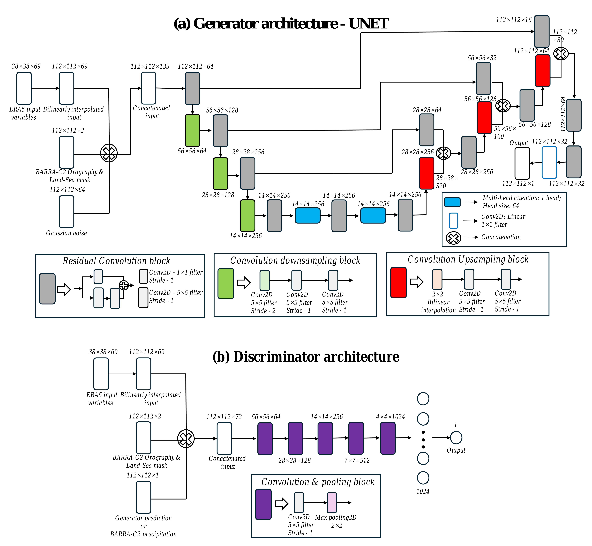
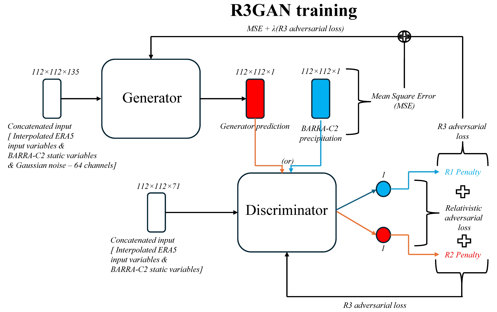

# R3GAN: Generating Ensembles for Convective-Scale Precipitation Downscaling Using Generative Machine Learning




This repository implements **R3GAN**, a distributed generative adversarial network (GAN) for downscaling of convective-scale precipitation using global ERA5 reanalysis and Australian regional reanalysis data.

---

## 📌 Project Highlights
- 📈 **Trained on massive datasets**: Over **359,000 training samples** (1980–2020) and **17,520 test samples** (2021–2022) used to ensure robust learning and generalization.
- 🎯 High-resolution precipitation ensemble generation using coarse ERA5 reanalysis inputs
- 🌍 Spatial conditioning with static variables (e.g., orography, land-sea mask)
- 🧠 Residual U-Net generator with multi-head attention
- 🧪 Relativistic GAN loss + zero-centered gradient penalties for stable training
- 🚀 Distributed training with Horovod + TensorFlow on multi-GPU systems (80 GPUs)
- 🧬 **R3GAN ensemble framework**: Combines **noise seeds**, **variance**, and **model epoch sampling** to enhance diversity in high-resolution precipitation generation.
- 🔁 **Multi-source ensemble generation**: Improves **calibration**, **diversity**, and **uncertainty quantification** for convective precipitation events.

---

## 🧠 Model Summary

### Generator (R3GAN):
- Residual U-Net with skip connections
- Multi-head self-attention at bottleneck
- Input: ERA5 patch, static variables, Gaussian noise
- Output: High-resolution precipitation ensemble member

### Discriminator:
- Convolutional classifier
- Relativistic comparison of real vs. generated patches and dual-sided zero-centered gradient penalties

- Losses include:
  - Mean Square Error (MSE)
  - Relativistic GAN Loss
  - Zero-centered Gradient Penalties (R1/R2)

### 📦 Data

This project uses high-volume climate and observation datasets in `.zarr` format:

- **`ERA5_ML_data.zarr`** — ERA5 climate reanalysis variables from 1980–2022 (coarse resolution)
- **`B2C_Pr_data_2k25.zarr`** — BARRA-C2 target high-resolution precipitation data
- **`B_C2_static.zarr`** — Static predictors including land-sea mask and orography

> 📁 These datasets are not included in this repository due to their large size.
>  
> 📬 For access or data instructions, please contact the author.
>
### 🚀 Training

This model is designed for large-scale distributed training using Horovod.

To train using **80 GPUs**, launch with:

```bash
horovodrun -np 80 -H localhost:80 python R3GAN/train_r3gan.py
```
Ensure that the system has proper NCCL support, GPU visibility settings, and TF_DISABLE_NVTX_RANGES / TF_CPP_MIN_LOG_LEVEL environment variables configured (as handled in utils.py).

## 🔍 Inference

Use the provided notebook [`scripts/inference.ipynb`](scripts/inference.ipynb) to generate **high-resolution precipitation ensemble predictions** using trained R3GAN generator models.

### This notebook demonstrates:

- 🔄 **Loading trained generator models** from saved `.h5` checkpoints
- 📥 **Preprocessing and loading ERA5 reanalysis inputs** and static variables from `.zarr` format
- 🎲 **Injecting random Gaussian noise seeds** to simulate ensemble diversity
- 🎯 **Generating downscaled precipitation fields** at convective resolution
- 🖼️ **Saving and visualizing output fields** for selected timesteps and ensemble members
- 📊 **Calculating basic ensemble statistics** across generated members

> ✅ Designed to support batch-wise inference over large datasets and multiple noise seeds for uncertainty quantification.


